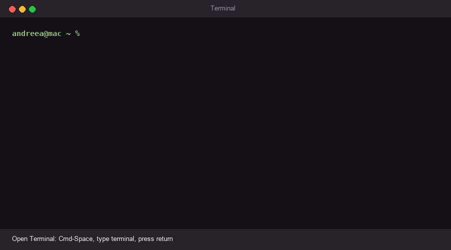

# Getting started

Two ways in. The first needs nothing but a browser and about five minutes. The
second is for people who have their own instance files or would rather call the
library directly.

---

## If you just want a number

One command, once. After that there is an icon you double-click, and you never
need a terminal again.



### First, open a terminal

A terminal is a window you type commands into. Every computer has one; it is
just kept out of the way. Find yours:

**On a Mac** it is called **Terminal**. Hold `Cmd` and press the space bar, type
`terminal`, and press return. A window with plain text in it appears. (It also
lives in Applications, in the Utilities folder, if you would rather look for
it.)

**On Windows** it is called **PowerShell**. Press the Windows key, type
`powershell`, and press return. A blue window with plain text appears. Windows
11 may call it **Terminal** instead; either is fine.

**On Linux** it is usually called **Terminal**. On most desktops
`Ctrl-Alt-T` opens one. Otherwise open the applications menu and search for
`terminal`: depending on the desktop it may be called Terminal, GNOME Terminal,
Konsole, or xfce4-terminal. All of them do the same thing here.

Nothing you paste can run without you pressing return, and nothing here asks for
your password except Linux, if Python has to be installed first.

### Then paste one line

**Mac and Linux**, copy this, paste it into the terminal window, and press
return:

```sh
curl -fsSL https://raw.githubusercontent.com/andreealeft/hybrid-benchmarking/main/install/install.sh | sh
```

**Windows**, copy this one instead:

```powershell
irm https://raw.githubusercontent.com/andreealeft/hybrid-benchmarking/main/install/install.ps1 | iex
```

To paste into a terminal: `Cmd-V` on a Mac, `Ctrl-V` on Windows,
`Ctrl-Shift-V` on Linux.

It takes about a minute. It installs into a folder of its own, writes an icon
onto your Desktop, and opens the tool in your browser straight away.

If Python is missing it says so: on a Mac it opens the download page, and on
Linux it prints the one command your system needs. Install it, then paste the
same line again.

**From then on, double-click the icon.** It opens in your browser in a few
seconds and keeps itself up to date, so this is the only time a terminal is
involved.

Everything lives in one folder of its own: under Application Support on a Mac,
AppData on Windows, and `.local/share` on Linux. The rest of your computer is
untouched, and uninstalling is deleting that folder and the icon.

### Using it

The menu on the left holds seventy-one problems under nine headings —
*choosing what to fund or build*, *deciding where to put things*, *avoiding
clashes*, and so on. Find the one that sounds like yours. If none does exactly,
pick the closest; several names are the same problem underneath, so being
approximately right is usually right.

Choose **Describe it**, and answer the questions in ordinary words — *how many
employees*, *how many shifts each can cover*, *how much room in the van*. Press
the button. You get, side by side, what each quantum method would cost on a
problem of that size, in gates or in cycles.

Three things worth knowing about those numbers.

**They describe a problem of your size, not your problem.** Answering "200
employees" builds a 200-employee example and measures that. The real cost
depends on the structure of your actual data, not only on how big it is. The
page says this above every result, and it is not a formality — for two
instances of the same size the counts can differ by a lot.

**The columns are not a race.** They are different methods measured in
different units; a gate and a cycle are not the same thing, and the tool
refuses to add them. Read each column on its own.

**Every number carries where it came from** — which lemma, what was assumed,
what regime it is valid in. That is the point of the tool. If a number ever
appears without it, that is a bug.

---

## If you have your own data

Pick **I have a data file** instead, or use the command line:

```sh
hybrid-benchmarking run instance.max
hybrid-benchmarking batch instances/ --budget 600   # a whole directory, tabulated
```

This reads the file, runs the classical algorithm on your machine with the
instrumentation in place, writes the log, and costs it. The log is shown; it is
a real artefact, not an intermediate step that gets hidden. If you already have
a log from your own instrumented solver, that path still works unchanged.

**The formats are specified but the list is short, and it is work in progress.**
What is read today:

| Your problem | File format | Usual extension |
|---|---|---|
| Maximum flow, and anything routed through a network | DIMACS maximum flow | `.max` |
| Covering, independent sets, cliques — anything on a graph | DIMACS graph or edge list | `.clq`, `.col`, `.edges` |
| Linear programmes and general allocation | MPS, fixed or free format | `.mps` |
| Knapsack | Pisinger or Martello–Toth layout | `.kp` |
| Quadratic knapsack (things worth more together) | Billionnet–Soutif layout | `.qkp` |
| Multidimensional knapsack (several limits at once) | OR-Library layout | `.mdkp` |
| Systems of equations, physical fields | Matrix Market | `.mtx` |

The reader is chosen by extension, and by the shape of the first few lines when
the extension does not settle it — the three knapsack layouts all ship as
`.txt`, so `--layout pisinger` (or `quadratic-knapsack`, `multidimensional-
knapsack`) names one outright. A file it cannot identify is refused rather than
guessed at, because a knapsack file read as an edge list produces a graph, not
an error.

Two limits to know before you convert anything:

- **A run has a budget**, five minutes by default, checked between iterations.
  A solve that runs out keeps its partial log and is marked *truncated*: the
  count is then a genuine lower bound on that instance, and says so. Raise it
  with `--budget`, in seconds.
- **Zero profits and zero weights are refused** in the knapsack layouts, with
  the line number. A zero has no lowest set bit, and that bit position is what
  the circuit's cost depends on. This blocks a good part of the published
  benchmark sets, and what it *should* cost instead is an open question rather
  than an oversight — see "Open decisions" in `CLAUDE.md`.

If your data is in a format not listed, converting it to one of these is
usually a short script. If it is a format that ought to be here, say so.

---

## If you would rather not use the interface

The interface is a client. It holds no mathematics of its own, and for anyone
comfortable in Python it is the slower way to work — every number in it is one
call away:

```python
import hybrid_benchmarking as hb

hb.get("QSearch").evaluate(X=1_000_000, t=1)
# <Cost 1411.14 iterations -- exact, analytic -- after Boyer-Brassard-Hoyer-Tapp
#  schedule; Lemma 6 of the thesis -- assuming the number of marked elements t
#  is known>

hb.get("HamSim/berry").evaluate(hb.Unit.GATES,
                                A_1=3, A_max=1, d=4, epsilon=1e-3, t_sim=10)
```

Or from a shell, without writing any Python:

```sh
hybrid-benchmarking list                       # everything, and in what units
hybrid-benchmarking show HamSim                # both constructions, with assumptions
hybrid-benchmarking formula QFT -u GATES       # the expression itself
hybrid-benchmarking cost QLS-Chebyshev -u QUERIES \
    -p d=4 -p kappa=10 -p epsilon=1e-8 -p x_norm=1
```

Doing your own counts means reading three files, in this order:

- `src/hybrid_benchmarking/routines/` — one module per family, each formula
  transcribed beside the lemma it comes from and the assumptions it carries.
  This is where the mathematics is.
- `src/hybrid_benchmarking/cost.py` and `provenance.py` — what a cost is, and
  the four rules that keep it honest: units that refuse to mix, named
  implementations, two-tiered validity, and composition that keeps the weakest
  ingredient's hedging.
- `CLAUDE.md` — every place a source was ambiguous and how it was ruled, every
  difference from the original repositories, and the open decisions. Read this
  before comparing any number here with a published one. Several of the
  differences are large and none of them is silent.

Composing is three moves — fill a slot, add two counts of the same thing,
multiply repetitions by what is repeated:

```python
cost = hb.get("QAE").cost(hb.Unit.GATES).bind(
    oracle_gates=hb.get("CanEnterNFP").cost(hb.Unit.GATES))
```

The result carries the union of the parameters, the weaker bound direction,
every assumption from either side, and both validity domains.

---

## If something goes wrong

- **`command not found: hybrid-benchmarking`** — the install put it somewhere
  not on your path. `python3 -m hybrid_benchmarking.cli` always works.
- **The page loads but a form never appears** — an older server is still
  running on port 8765 from a previous session, serving the new page with an
  old interface. Stop it (`Ctrl-C`, or close that terminal) and start again.
- **The port is taken** — `hybrid-benchmarking --port 8900`.
- **A file is refused** — the message names the line and what was wrong with
  it. That is deliberate: a refused file is better than a plausible number
  computed from a misread one.

To check the installation is sound:

```sh
pip3 install -e ".[dev]"
python3 -m pytest
```

1768 tests, a few seconds.
